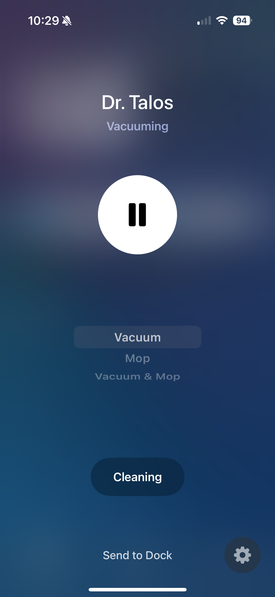
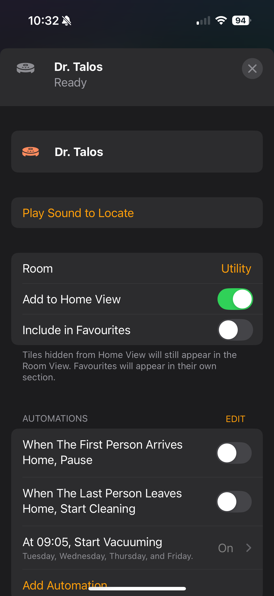

# valetudo-matter

A [Matter](https://csa-iot.org/all-solutions/matter/) bridge for
[Valetudo](https://valetudo.cloud/)-controlled robot vacuums. Runs on the robot next to valetudo.

> [!NOTE]
> I'm not affiliated with Valetudo and this is not an official extension; please ask for support here, not there.

<p align="center">
  
  &nbsp;&nbsp;&nbsp;&nbsp;
  
</p>

## Supported features

- Basic start/stop/pause
- Cleaning mode selection
- Room selection

## Installation

Download the correct release for your platform to the robot. Then add something like the following to `data/_root_postboot.sh` after Valetudo starts:

```sh
if [[ -f /data/valetudo-matter ]]; then
        sleep 30
	VALETUDO_MATTER_BASE_URI=http://localhost VALETUDO_MATTER_PERSISTENCE=/data/matter \ 
	    /data/valetudo-matter > /dev/null 2>&1 &
fi
```

In order to get the commissioning code, run the tool once with debug logging:

```sh
RUST_LOG=info /data/valetudo-matter
```

It'll print a QR code for comissioning. Once that's completed, you can kill the process and reboot the robot.
